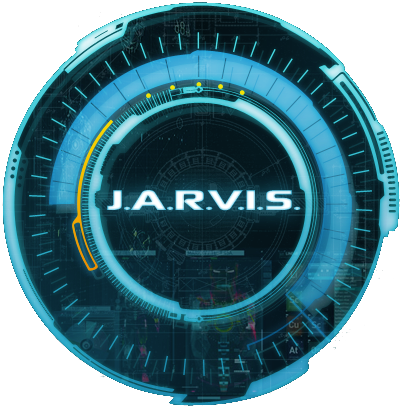

## Hey , I'm [Gaurav Sharma!](https://gsharma101.github.io/Gaurav-Sharma.github.io/)  
## Little about myself

<!-- Basic Introduction -->
- 🔭 I’m currently working on my skills & Networking with people
- 🌱 Learning Full Stack Development.
- 👯 I share my knowledge through [YouTube!](https://www.youtube.com/channel/UCjGI95t_UwwX_F-gDubP7YA)
- 📫 How to reach me: quantumprogrammers010@gmail.com
- ⚡ No amount of money ever bought a second of time.
- 👤 Jarvis is my assistant.

### Get In Touch 📞

 

### Languages and Tools

 
 
<!--Most Used Languages Stats-->

---

<!--GitHub Stats-->

 
